**Cplex Java API**

**Contents**

<!-- MarkdownTOC -->

- [1 Cplex Java API的安装与配置](#1-cplex-java-api的安装与配置)
- [2 Cplex建模](#2-cplex建模)
    - [2.1 类与接口](#21-类与接口)
    - [2.2 变量 Variables](#22-变量-variables)
        - [2.2.1 简介](#221-简介)
        - [2.2.2 常用函数](#222-常用函数)
        - [2.2.3 数组形式添加](#223-数组形式添加)
    - [2.3 表达式 Expressions](#23-表达式-expressions)
        - [2.3.1 简介](#231-简介)
        - [2.3.2 子类 IloLinearNumExpr 常用函数](#232-子类-ilolinearnumexpr-常用函数)
    - [2.4 约束 Ranged constraints](#24-约束-ranged-constraints)
        - [2.4.1 添加约束](#241-添加约束)
            - [2.4.1.1 lb <= expr <= ub](#2411-lb--expr--ub)
            - [2.4.1.2 expr <= ub](#2412-expr--ub)
            - [2.4.1.3 expr >= lb](#2413-expr--lb)
        - [2.4.2 IloRange的常用函数](#242-ilorange的常用函数)
    - [2.5 目标函数 Objective function](#25-目标函数-objective-function)
        - [2.5.1 常用函数](#251-常用函数)
    - [2.6 建模方式](#26-建模方式)
        - [2.6.1 按行建模populateByRow](#261-按行建模populatebyrow)
        - [2.6.2 按列建模populateByColumn](#262-按列建模populatebycolumn)
            - [2.6.2.1 过程](#2621-过程)
            - [2.6.2.2 代码示例](#2622-代码示例)
        - [2.6.3 按非零建模populateByNonzero（不常用）](#263-按非零建模populatebynonzero（不常用）)
    - [2.7 模型求解](#27-模型求解)
    - [2.8 获取解的信息](#28-获取解的信息)
        - [2.8.1 目标函数](#281-目标函数)
        - [2.8.2 变量](#282-变量)
        - [2.8.3 约束](#283-约束)
            - [2.8.3.1 松弛变量](#2831-松弛变量)
            - [2.8.3.2 对偶变量](#2832-对偶变量)
        - [2.8.4 极射线](#284-极射线)
    - [2.9 模型导入与导出](#29-模型导入与导出)
    - [2.10 参数](#210-参数)
        - [2.10.1 官方介绍](#2101-官方介绍)
        - [2.10.2 常用参数](#2102-常用参数)
            - [2.10.2.1 运行时间](#21021-运行时间)
            - [2.10.2.2 Random seed](#21022-random-seed)
            - [2.10.2.3 Presolve](#21023-presolve)
            - [2.10.2.4 RootAlgorithm](#21024-rootalgorithm)
            - [2.10.2.5 Tolerance](#21025-tolerance)
            - [2.10.2.6 NodeAlgorithm](#21026-nodealgorithm)
            - [2.10.2.7 Benders Strategy](#21027-benders-strategy)
            - [2.10.2.8 Search Strategy](#21028-search-strategy)
            - [2.10.2.9 MIP 割平面开关](#21029-mip-割平面开关)
            - [2.10.2.10 MIP 节点选择策略](#210210-mip-节点选择策略)
            - [2.10.2.11 MIP 分支方向](#210211-mip-分支方向)
            - [2.10.2.12 MIP 解池中的目标值允许Gap](#210212-mip-解池中的目标值允许gap)
            - [2.10.2.13 MIP 节点数量限制](#210213-mip-节点数量限制)
            - [2.10.2.14 MIP 强调参数](#210214-mip-强调参数)
            - [2.10.2.15 MIP 节点日志显示信息](#210215-mip-节点日志显示信息)
            - [2.10.2.16 调节信息显示](#210216-调节信息显示)
            - [2.10.2.17 单纯形法信息显示](#210217-单纯形法信息显示)
            - [2.10.2.18 MIP 节点日志间隔](#210218-mip-节点日志间隔)
            - [2.10.2.19 MIP heuristic frequency](#210219-mip-heuristic-frequency)
    - [2.11 其他](#211-其他)
        - [2.11.1 逻辑约束](#2111-逻辑约束)
- [3 Legacy Callback](#3-legacy-callback)
    - [3.1 参考回调Informational callback](#31-参考回调informational-callback)
        - [3.1.1 简介](#311-简介)
        - [3.1.2 涉及的类](#312-涉及的类)
        - [3.1.3 示例文件MIPex4.java](#313-示例文件mipex4java)
            - [3.1.3.1 功能一：基于求解时间和gap控制程序是否终止](#3131-功能一：基于求解时间和gap控制程序是否终止)
            - [3.1.3.2 功能二：打印日志](#3132-功能二：打印日志)
    - [3.2 查询或诊断回调Query or diagnostic callbacks](#32-查询或诊断回调query-or-diagnostic-callbacks)
        - [3.2.1 简介](#321-简介)
        - [3.2.2 调用位置](#322-调用位置)
    - [3.3 控制回调](#33-控制回调)
        - [3.3.1 简介](#331-简介)
        - [3.3.2 使用场景](#332-使用场景)
            - [3.3.2.1 节点回调](#3321-节点回调)
            - [3.3.2.2 求解回调](#3322-求解回调)
            - [3.3.2.3 用户割平面回调](#3323-用户割平面回调)
            - [3.3.2.4 惰性约束回调](#3324-惰性约束回调)
            - [3.3.2.5 探试回调](#3325-探试回调)
            - [3.3.2.6 分支回调](#3326-分支回调)
            - [3.3.2.7 现任解回调](#3327-现任解回调)
    - [3.4 回调的终止](#34-回调的终止)
    - [3.5 Legacy Callback示例](#35-legacy-callback示例)
        - [3.5.1 AdMIPex1: node and branch callbacks](#351-admipex1-node-and-branch-callbacks)
            - [3.5.1.1 branch callbacks](#3511-branch-callbacks)
            - [3.5.1.2 node callbacks](#3512-node-callbacks)
        - [3.5.2 AdMIPex3: Special Ordered Sets Type 1](#352-admipex3-special-ordered-sets-type-1)
        - [3.5.3 AdMIPex2: HeuristicCallback](#353-admipex2-heuristiccallback)
        - [3.5.4 AdMIPex4: UserCutCallback and LazyConstraintCallback](#354-admipex4-usercutcallback-and-lazyconstraintcallback)
        - [3.5.5 AdMIPex5: UserCutCallback and LazyConstraintCallback](#355-admipex5-usercutcallback-and-lazyconstraintcallback)
            - [3.5.5.1 UserCutCallback](#3551-usercutcallback)
            - [3.5.5.2 UserCutCallback](#3552-usercutcallback)
            - [3.5.5.3 LazyConstraintCallback](#3553-lazyconstraintcallback)
        - [3.5.6 AdMIPex6: SolveCallback：passing in a solution for the root node](#356-admipex6-solvecallback：passing-in-a-solution-for-the-root-node)
- [4 Generic Callback](#4-generic-callback)
    - [4.1 简介](#41-简介)
    - [4.2 功能](#42-功能)
    - [4.3 通用回调的上下文Context](#43-通用回调的上下文context)
        - [4.3.1 IloCplex.Callback.Context.Id中的上下文常量](#431-ilocplexcallbackcontextid中的上下文常量)
            - [4.3.1.1 ThreadUp](#4311-threadup)
            - [4.3.1.2 ThreadDown](#4312-threaddown)
            - [4.3.1.3 LocalProgress](#4313-localprogress)
            - [4.3.1.4 GlobalProgress](#4314-globalprogress)
            - [4.3.1.5 Candidate](#4315-candidate)
            - [4.3.1.6 Relaxation](#4316-relaxation)
        - [4.3.2 使用方法](#432-使用方法)
    - [4.4 Generic Callback示例](#44-generic-callback示例)
        - [4.4.1 AdMIPex8: Cut](#441-admipex8-cut)
        - [4.4.2 AdMIPex9: HeuristicCallback](#442-admipex9-heuristiccallback)
- [5 Cplex 官方示例说明](#5-cplex-官方示例说明)

<!-- /MarkdownTOC -->


<a id="1-cplex-java-api的安装与配置"></a>
# 1 Cplex Java API的安装与配置
1. 下载安装Cplex，并记住安装目录

2. 导入Cplex.jar包
    - Step 1  
    
    - Step 2
    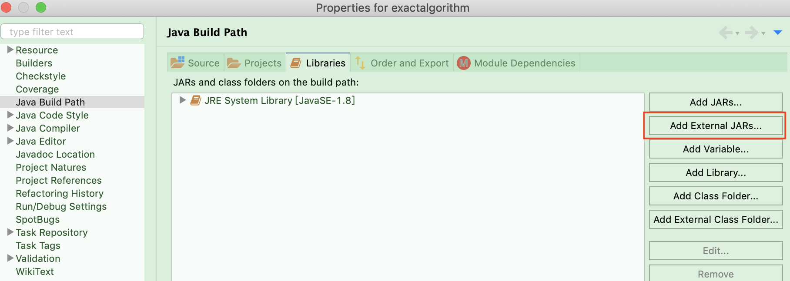
    - Step 3
    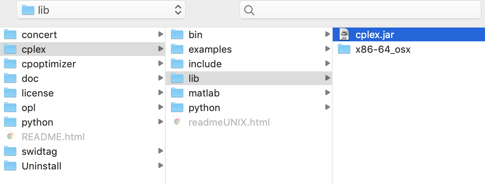

3. Javadoc
    - 设置
        + Step 1
        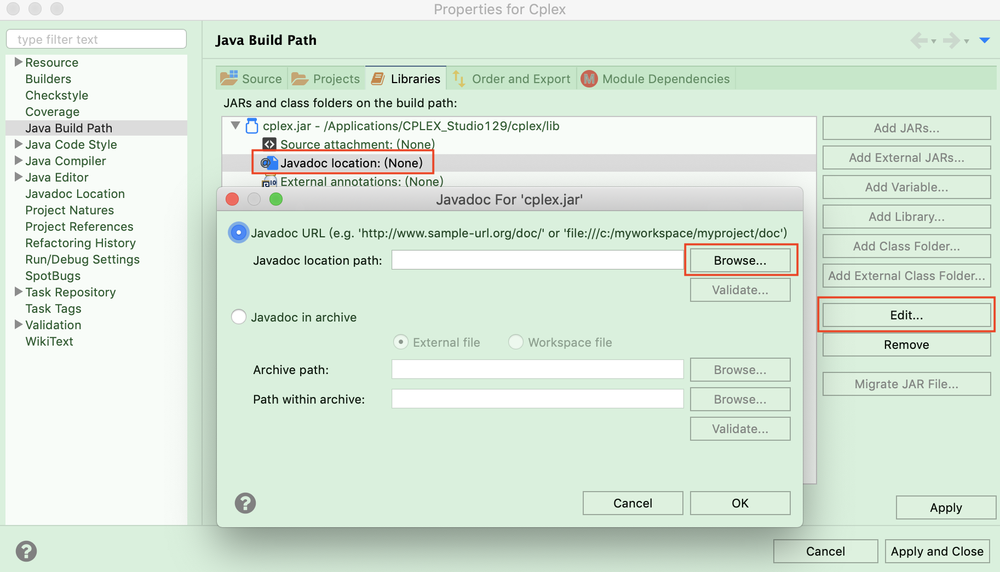
        + Step 2
        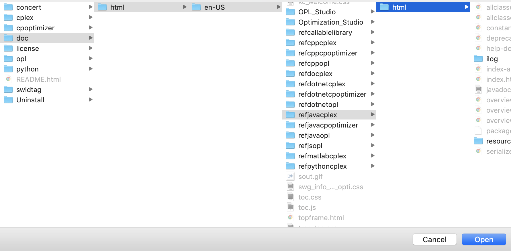
    - 效果
        + 悬停查看类、方法、属性等的说明
        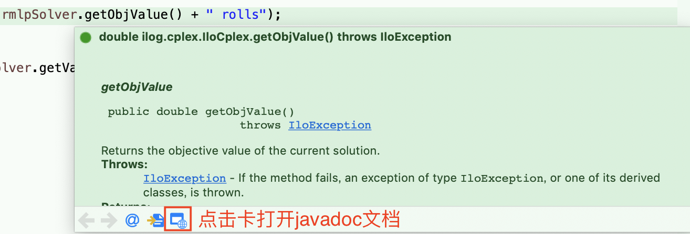

        + 在Eclipse中直接打开javadoc文档
        + 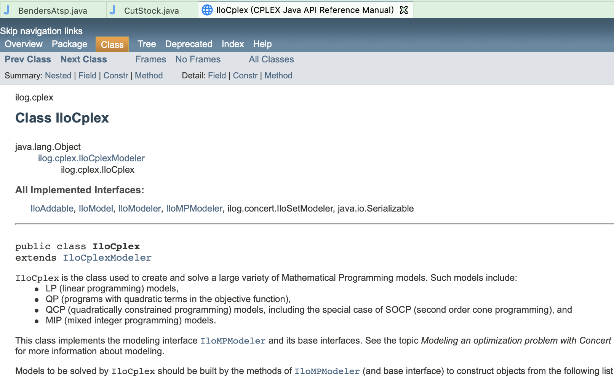


4. Djava.library.path
    - 方法一：设置JVM参数，<https://www.ibm.com/support/knowledgecenter/SSSA5P_12.5.0/ilog.odms.cplex.help/CPLEX/GettingStarted/topics/set_up/Eclipse.html>
    - 方法二：设置Native Library Location
        + Step 1
        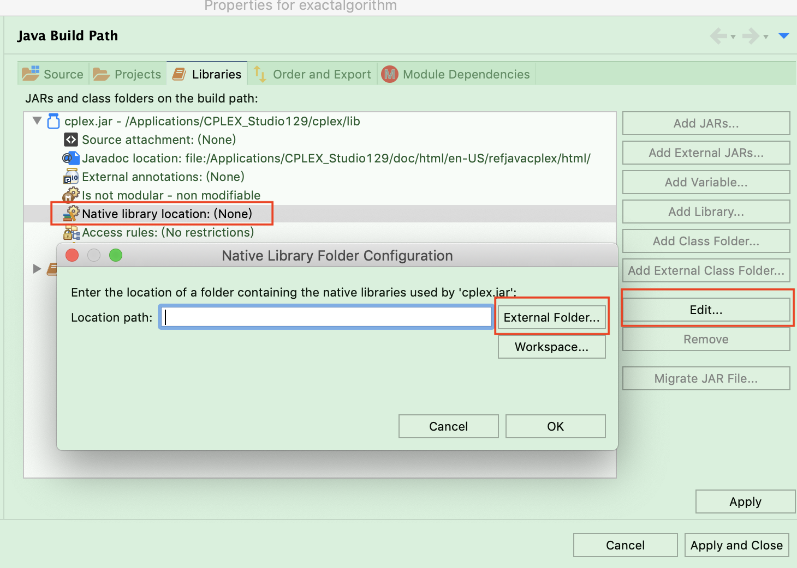
        + Step 2
        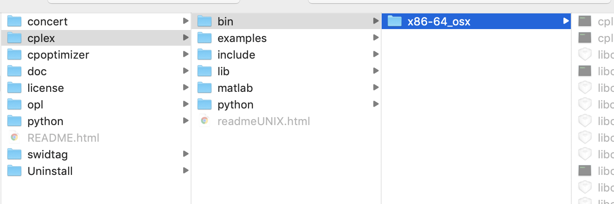

5. 完成
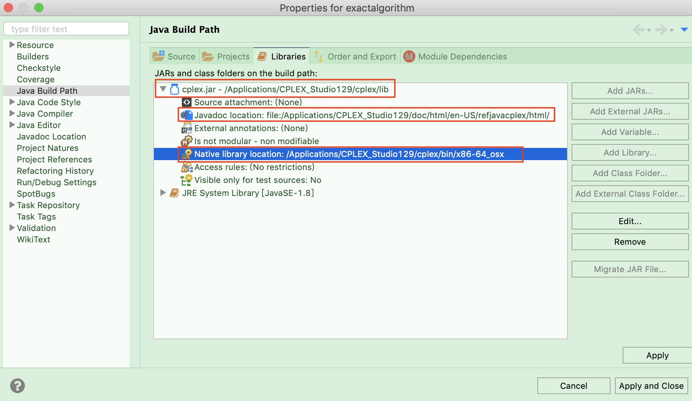

<a id="2-cplex建模"></a>
# 2 Cplex建模
<a id="21-类与接口"></a>
## 2.1 类与接口
* IloCplexModeler Class
* IloModeler Interfaces
* **`IloCplex class`**
    - The class IloCplex extends IloCplexModeler
    - IloCplex implements the solving methods
    - IloCplex implements interfaces IloModeler

**一般使用 IloCplex cplex = new IloCplex() 新建模型**

<a id="22-变量-variables"></a>
## 2.2 变量 Variables
<a id="221-简介"></a>
### 2.2.1 简介
* 变量类型
    - 0-1变量：IloNumVarType.Bool
    - 整型变量：IloNumVarType.Int
    - 连续变量：IloNumVarType.Float
* 变量一般使用 `IloNumVar` 对象

<a id="222-常用函数"></a>
### 2.2.2 常用函数
* **`IloCplex.numVar(double lb, double ub, IloNumVarType type, String name)`**
* IloCplex.intVar(): To create integer variables
* IloCplex.boolVar(): To create 0 / 1 variables

<a id="223-数组形式添加"></a>
### 2.2.3 数组形式添加
* numVarArray()
* intVarArray()
* boolVarArray()


<a id="23-表达式-expressions"></a>
## 2.3 表达式 Expressions
<a id="231-简介"></a>
### 2.3.1 简介
* 模型的目标函数和约束基于表达式进行定义
* 基于 `IloNumExpr` 接口及其子接口
* 方法
    - IloModeler.sum
    - IloModeler.prob: 常用于一个表达式（变量）与常数的乘积
        + 仓库容量限制：IloModeler.prod(capacity, opened[j])
    - IloModeler.scalProd: 常用于变量数组与系数数组的点积
        + 仓库开通成本计算：IloModeler.scalProd(cost[c], supply[c])
    - IloModeler.diff: 相减
    - IloModeler.negative: 乘-1
    - IloModeler.square
* 常用的场景
    - 当表达式由多个`常数项`，多个`系数与变量的乘积`组成，采用 IloNumExpr 接口
    - 当表达式由多个`系数和变量的乘积`组成，采用 IloLinearNumExpr 接口
    - IloLinearNumExpr 接口在初始化时可以指定常数部分，因此对于第一种场景也可先通过 double 类型进行求和然后在初始化的时候作为常数项一次性添加，至于剩下的多个`系数与变量的乘积`可使用 `addTerm`方法添加

<a id="232-子类-ilolinearnumexpr-常用函数"></a>
### 2.3.2 子类 IloLinearNumExpr 常用函数
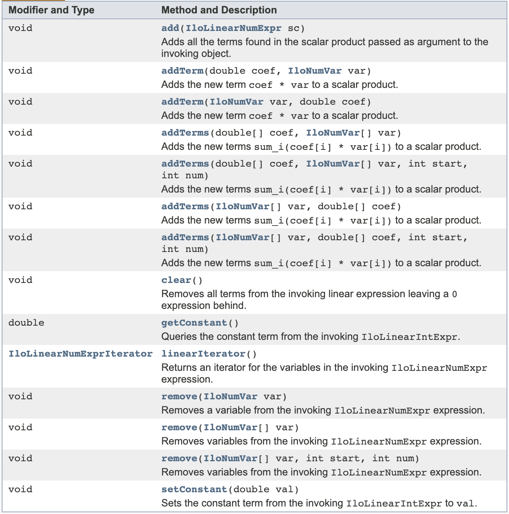


<a id="24-约束-ranged-constraints"></a>
## 2.4 约束 Ranged constraints
* 使用 IloRange 对象
* 表示形如 lb <= expression <= ub 的约束

<a id="241-添加约束"></a>
### 2.4.1 添加约束
<a id="2411-lb--expr--ub"></a>
#### 2.4.1.1 lb <= expr <= ub
IloRange rng = cplex.range(lb, expr, ub, name);
    
    - lb and ub are double values
    - expr is of type IloNumExpr
    - name is a string

<a id="2412-expr--ub"></a>
#### 2.4.1.2 expr <= ub
* IloRange le = IloCplex.le(expr, ub, name)
* IloCplex.addLe(expr, ub, name)
* 相比第一种，第二种会把约束加入到当前模型中

<a id="2413-expr--lb"></a>
#### 2.4.1.3 expr >= lb
* IloRange ge = IloCplex.le(expr, lb, name)
* IloCplexModeler.addGe(expr, lb, name)
* 相比第一种，第二种会把约束加入到当前模型中

<a id="242-ilorange的常用函数"></a>
### 2.4.2 IloRange的常用函数
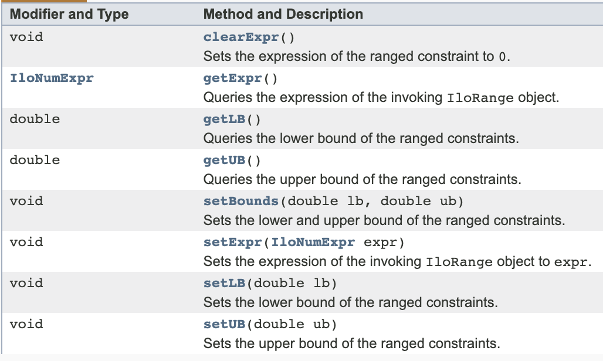


<a id="25-目标函数-objective-function"></a>
## 2.5 目标函数 Objective function
* 使用IloObjective对象
* 三要素
    - sense: Maximize or Minimize
    - expression: 目标函数表达式
    - name: 目标函数名称（可选参数）

<a id="251-常用函数"></a>
### 2.5.1 常用函数
* IloObjective obj = IloCplexModeler.addMaximize(expr)
* IloObjective obj = IloCplexModeler.add(cplex.maximize(expr))
* setExpr(expr): 可用于更新目标函数，如列生成中的pricing problem


<a id="26-建模方式"></a>
## 2.6 建模方式

<a id="261-按行建模populatebyrow"></a>
### 2.6.1 按行建模populateByRow
```
Input data:
foodMin[j]          minimum amount of food j to use
foodMax[j]          maximum amount of food j to use 
foodCost[j]         cost for one unit of food j
nutrMin[i]          minimum amount of nutrient i
nutrMax[i]          maximum amount of nutrient i
nutrPerFood[i][j]   nutrition amount of nutrient i in food j

Modeling variables:
buy[j]              amount of food j to purchase

Objective:
minimize sum(j) buy[j] * foodCost[j]

Constraints:
forall foods i: nutrMin[i] <= sum(j) buy[j] * nutrPer[i][j] <= nutrMax[j]
```

```JAVA
static void buildModelByRow(IloModeler model, Data data, IloNumVar[] buy, IloObjective cost, IloNumVarType type)
        throws IloException {
    int nFoods = data.nFoods;
    int nNutrs = data.nNutrs;

    // 以循环方式新建变量
    for (int j = 0; j < nFoods; j++) {
        buy[j] = model.numVar(data.foodMin[j], data.foodMax[j], type);
    }

    // 设置目标函数
    cost.setExpr(model.scalProd(data.foodCost, buy));

    // 按行添加约束
    for (int i = 0; i < nNutrs; i++) {
        model.addRange(data.nutrMin[i], model.scalProd(data.nutrPerFood[i], buy), data.nutrMax[i]);
    }
}
```


<a id="262-按列建模populatebycolumn"></a>
### 2.6.2 按列建模populateByColumn
按列添加本质上是添加变量，需要考虑:

* 对目标函数的影响
* 对约束的影响

<a id="2621-过程"></a>
#### 2.6.2.1 过程
1. 假设模型为 IloMPModeler model
2. 取出目标函数（引用），得到 IloObjective objective
3. 设置约束的lowerBound和upperBound，得到 IloRange[] constraint
4. 对每个变量
    * 与该变量对应的系数一起添加到目标函数中，并返回新一个列对象  
        - **`IloColumn col = model.column(objective, coefficient)`**
    * 对每个约束
        - 使用 **`model.column(IloRange constraint[i], double val)`** 为变量添加在该约束中的系数，并返回一个列对象 IloColumn col2
        - 使用IloColumn.and()函数将 col 与 col2 进行“连接”  
        **`col = col.and(col2)`**
        - 完成了对目标函数以及约束的更新
    * 使用 **`model.numVar(IloColumn col, double lb, double ub, IloNumVarType type)`** 为新的列设置对应的变量（包括上下界、类型）


<a id="2622-代码示例"></a>
#### 2.6.2.2 代码示例
```JAVA
static void buildModelByColumn(IloMPModeler model, Data data, IloNumVar[] buy, IloObjective cost,
        IloNumVarType type) throws IloException {
    int nFoods = data.nFoods;
    int nNutrs = data.nNutrs;

    IloRange[] constraint = new IloRange[nNutrs];

    // 设置约束的lowerBound和upperBound
    for (int i = 0; i < nNutrs; i++) {
        constraint[i] = model.addRange(data.nutrMin[i], data.nutrMax[i]);
    }

    for (int j = 0; j < nFoods; j++) {
        // 与该变量对应的系数一起添加到目标函数中，并返回新一个列对象
        IloColumn col = model.column(cost, data.foodCost[j]);
        for (int i = 0; i < nNutrs; i++) {
            // 为变量添加在该约束中的系数，并返回一个列对象，使用IloColumn.and()“连接”两个列
            col = col.and(model.column(constraint[i], data.nutrPerFood[i][j]));
        }
        // 为新的列设置对应的变量（包括上下界、类型）
        buy[j] = model.numVar(col, data.foodMin[j], data.foodMax[j], type);
    }
}
```

<a id="263-按非零建模populatebynonzero（不常用）"></a>
### 2.6.3 按非零建模populateByNonzero（不常用）
A Simlpe Model(Example: LPex1.java)
```
The following methods all populate the problem with data for the following
linear program:

Maximize
x1 + 2 x2 + 3 x3
Subject To
- x1 + x2 + x3 <= 20
x1 - 3 x2 + x3 <= 30
Bounds
0 <= x1 <= 40
End
```

```JAVA
static void populateByNonzero(IloMPModeler model, IloNumVar[][] var, IloRange[][] rng) throws IloException {
    double[] lb = { 0.0, 0.0, 0.0 };
    double[] ub = { 40.0, Double.MAX_VALUE, Double.MAX_VALUE };
    IloNumVar[] x = model.numVarArray(3, lb, ub);
    var[0] = x;

    double[] objvals = { 1.0, 2.0, 3.0 };
    model.add(model.maximize(model.scalProd(x, objvals)));

    rng[0] = new IloRange[2];
    rng[0][0] = model.addRange(-Double.MAX_VALUE, 20.0);
    rng[0][1] = model.addRange(-Double.MAX_VALUE, 30.0);

    rng[0][0].setExpr(model.sum(model.prod(-1.0, x[0]), model.prod(1.0, x[1]), model.prod(1.0, x[2])));
    rng[0][1].setExpr(model.sum(model.prod(1.0, x[0]), model.prod(-3.0, x[1]), model.prod(1.0, x[2])));

    x[0].setName("x1");
    x[1].setName("x2");
    x[2].setName("x3");
    rng[0][0].setName("c1");
    rng[0][1].setName("c2");
}
```


<a id="27-模型求解"></a>
## 2.7 模型求解
* 调用IloCplex.slove()
* 解的类型分类 IloCplex.Status
    - Bounded
    - Unbounded
    - Feasible
    - Infeasible
    - InfeasibleOrUnbounded
    - Error
    - Unknown
    - Optimal
* 可结合[参数](#210-参数)部分，在求解前进行相关设置

<a id="28-获取解的信息"></a>
## 2.8 获取解的信息
<a id="281-目标函数"></a>
### 2.8.1 目标函数
IloCplex.getObjValue()

<a id="282-变量"></a>
### 2.8.2 变量
* 获取单个变量值 double IloCplex.getValue(var)
* 获取变量数组的值 double[] IloCplex.getValues(vars)
* IloCplex.getReducedCost(ivar)
* IloCplex.getReducedCosts(vars)

<a id="283-约束"></a>
### 2.8.3 约束
<a id="2831-松弛变量"></a>
#### 2.8.3.1 松弛变量
* IloCplex.getSlack(IloRange rng)
* IloCplex.getSlacks(IloRange[] rng)
* IloCplex.getSlacks(IloLPMatrix matrix)

<a id="2832-对偶变量"></a>
#### 2.8.3.2 对偶变量
* IloCplex.getDual(IloRange rng)
* IloCplex.getDuals(IloRange[] rng)
* IloCplex.getDuals(IloLPMatrix matrix)

<a id="284-极射线"></a>
### 2.8.4 极射线
IloLinearNumExpr IloCplex.getRay()


<a id="29-模型导入与导出"></a>
## 2.9 模型导入与导出
* Exporting models  
IloCplex.exportModel(“diet.lp")

* Importing models  
IloCplex.importModel()


<a id="210-参数"></a>
## 2.10 参数
<a id="2101-官方介绍"></a>
### 2.10.1 官方介绍
[Cplex官方参数介绍链接](https://www.ibm.com/support/knowledgecenter/zh/SSSA5P_12.8.0/ilog.odms.cplex.help/CPLEX/Parameters/topics/introListAlpha.html)

<a id="2102-常用参数"></a>
### 2.10.2 常用参数
<a id="21021-运行时间"></a>
#### 2.10.2.1 运行时间
IloCplex.Param.TimeLimit

<a id="21022-random-seed"></a>
#### 2.10.2.2 Random seed
设置随机种子，IloCplex.setParam(IloCplex.Param.RandomSeed, seed);

<a id="21023-presolve"></a>
#### 2.10.2.3 Presolve
* 关闭预求解，IloCplex.setParam(IloCplex.Param.Preprocessing.Presolve, false)
* 关闭预求解缩减，IloCplex.setParam(IloCplex.Param.Preprocessing.Reduce, 0);

<a id="21024-rootalgorithm"></a>
#### 2.10.2.4 RootAlgorithm
* 使用单纯形法求解第一个LP问题，IloCplex.setParam(IloCplex.Param.RootAlgorithm, IloCplex.Algorithm.Primal)，也可以调用其他算法：
    - 0, IloCplex.Algorithm.Auto: 自动选择
    - 1, IloCplex.Algorithm.Primal: 单纯形法
    - 2, IloCplex.Algorithm.Dual: 对偶单纯形法
    - 3, IloCplex.Algorithm.Network: network simplex algorithm
    - 4, IloCplex.Algorithm.Barrier: barrier algorithm
    - 5, IloCplex.Algorithm.Sifting: use the sifting algorithm
    - 6, IloCplex.Algorithm.Concurrent:  use multiple algorithms concurrently on a multiprocessor system
* 可参考示例文件LPex7.java

<a id="21025-tolerance"></a>
#### 2.10.2.5 Tolerance
* IloCplex.Param.Simplex.Tolerances.Optimality
    - Influences the reduced-cost tolerance for optimality
    - This parameter governs how closely CPLEX must approach the theoretically optimal solution
    - Value: Any number from 1e-9 to 1e-1; default: 1e-06
* IloCplex.Param.Simplex.Tolerances.Markowitz
    - Influences pivot selection during basis factoring
    - Increasing the Markowitz threshold may improve the numerical properties of the solution
    - Value: Any number from 0.0001 to 0.99999; default: 0.01
* IloCplex.Param.Simplex.Tolerances.Feasibility
    - Specifies the feasibility tolerance, that is, the degree to which values of the basic variables calculated by the simplex method may violate their bounds.
    - Value: Any number from 1e-9 to 1e-1; default: 1e-06.

<a id="21026-nodealgorithm"></a>
#### 2.10.2.6 NodeAlgorithm
IloCplex.Param.NodeAlgorithm，可选算法：

* 0, IloCplex.Algorithm.Auto: 自动选择
* 1, IloCplex.Algorithm.Primal 单纯形法
* 2, IloCplex.Algorithm.Dual: 对偶单纯形法
* 3, IloCplex.Algorithm.Network: network simplex algorithm
* 4, IloCplex.Algorithm.Barrier: barrier algorithm
* 5, IloCplex.Algorithm.Sifting: use the sifting algorithm

<a id="21027-benders-strategy"></a>
#### 2.10.2.7 Benders Strategy
IloCplex.Param.Benders.Strategy，可选：

* -1, IloCplex.BendersStrategy.Off
    - 执行传统分支和界限；忽略任何 Benders 注释，也不使用 Benders 算法

* 0, IloCplex.BendersStrategy.Auto
    - 情况 1：用户未向模型提供注释  
    CPLEX 执行传统传统分制定界法
    - 情况 2：用户提供了注释  
    CPLEX 根据注释分解成主问题和子问题，并且尝试能否进一步分解子问题

* 1, IloCplex.BendersStrategy.User
    - CPLEX 严格根据注释分解模型

* 2, IloCplex.BendersStrategy.Workers
    - CPLEX 根据注释确定主问题，并尝试将剩余的变量分解成不相关的子问题并交给不同的Worker

* 3, IloCplex.BendersStrategy.Full: CPLEX自动分解模型，忽略可能提供的任何注释
    - 将所有整数变量放入到主问题
    - 将所有连续变量放入到子问题
    - 进一步分解此子问题（如果可能）

**`注意：如果用户注释错误，Cplex会抛出错误，即使 Auto 也不是完全“智能”的。`**


**Benders注释分解示例**  
```JAVA
// Create an annotation and you can set a default value here
IloCplex.LongAnnotation benders = cplex.newLongAnnotation(IloCplex.CPX_BENDERS_ANNOTATION);

// Put the binary "use" variables in the master problem，0 represents master problem
for (IloNumVar u : use) {
    cplex.setAnnotation(benders, u, 0);
}

/*
 * The LP portion does not decompose into smaller problems,
 * so we put all the "ship" variables in subproblem 1.
 * If the LP portion can be decomposed, wen can assign 2, 3, 4... to the variable
 */
for (IloNumVar[] s : ship) {
    for (IloNumVar s0 : s) {
        cplex.setAnnotation(benders, s0, 1);
    }
}
// Set the default Benders strategy to be adherence to our design.
cplex.setParam(IloCplex.Param.Benders.Strategy,
                   IloCplex.BendersStrategy.User);
```


<a id="21028-search-strategy"></a>
#### 2.10.2.8 Search Strategy
IloCplex.Param.MIP.Strategy.Search，可选:

* 0, IloCplex.MIPSearch.Auto 默认自动选择
* 1, IloCplex.MIPSearch.Traditional 使用分支定界策略
* 2, IloCplex.MIPSearch.Dynamic 使用动态搜索策略            


<a id="21029-mip-割平面开关"></a>
#### 2.10.2.9 MIP 割平面开关
1.  Gomory Cuts
    * IloCplex.Param.MIP.Cuts.Gomory

2. 最大团 Cliques Cuts
    * IloCplex.Param.MIP.Cuts.Cliques
    * A clique is a relationship among a group of binary variables such that at most one variable in the group can be positive in any integer feasible solution. Before optimization starts, CPLEX constructs a graph representing these relationships and finds maximal cliques in the graph.

3. 最小覆盖 Cover Cuts
    * IloCplex.Param.MIP.Cuts.Covers
    * If a constraint takes the form of a knapsack constraint (that is, a sum of binary variables with nonnegative coefficients less than or equal to a nonnegative righthand side), then there is a minimal cover associated with the constraint. A minimal cover is a subset of the variables of the inequality such that if all the subset variables were set to one, the knapsack constraint would be violated, but if any one subset variable were excluded, the constraint would be satisfied. CPLEX can generate a constraint corresponding to this condition, and this cut is called a cover cut.

4. MIR Cuts
    * IloCplex.Param.MIP.Cuts.MIRCut
    * MIR cuts are generated by applying integer rounding on the coefficients of integer variables and the righthand side of a constraint.

5. Zero-half cuts
    * IloCplex.Param.MIP.Cuts.ZeroHalfCut
    * Zero-half cuts are based on the observation that when the lefthand side of an inequality consists of integral variables and integral coefficients, then the righthand side can be rounded down to produce a zero-half cut. 

4. Flow Cover Cuts
    * IloCplex.Param.MIP.Cuts.FlowCovers
    * Flow covers are generated from constraints that contain continuous variables, where the continuous variables have variable upper bounds that are zero or positive depending on the setting of associated binary variables. The idea of a flow cover comes from considering the constraint containing the continuous variables as defining a single node in a network where the continuous variables are in-flows and out-flows. The flows will be on or off depending on the settings of the associated binary variables for the variable upper bounds. The flows and the demand at the single node imply a knapsack constraint. That knapsack constraint is then used to generate a cover cut on the flows (that is, on the continuous variables and their variable upper bounds).

5. Flow path Cuts
    * IloCplex.Param.MIP.Cuts.PathCut
    * Flow path cuts are generated by considering a set of constraints containing the continuous variables that define a path structure in a network, where the constraints are nodes and the continuous variables are in-flows and out-flows. The flows will be on or off depending on the settings of the associated binary variables.

6. Global Implied bounds Cut
    * IloCplex.Param.MIP.Cuts.Implied
    * In some models, binary variables imply bounds on nonbinary variables (that is, general integer variables and continuous variables). CPLEX generates cuts to reflect these relationships.
    * CPLEX generates global implied bound cuts by using globally valid bounds on the continuous variables in the model. For a parameter to control this activity, see the documentation of the MIP globally valid implied bound cuts switch in the CPLEX Parameters Reference Manual.

7. Lift and project cuts
    * IloCplex.Param.MIP.Cuts.LiftProj
    * <https://www.ibm.com/support/knowledgecenter/en/SSSA5P_12.6.3/ilog.odms.cplex.help/CPLEX/UsrMan/topics/discr_optim/mip/cuts/35_liftproj.html>

<a id="210210-mip-节点选择策略"></a>
#### 2.10.2.10 MIP 节点选择策略
IloCplex.Param.MIP.Strategy.NodeSelect

* 0, IloCplex.NodeSelect.DFS 深度优先搜索
* 1, IloCplex.NodeSelect.BestBound 最佳边界搜索；缺省值
* 2, IloCplex.NodeSelect.BestEst 最佳估算搜索
* 3, IloCplex.NodeSelect.BestEstAlt 备用最佳估算搜索

<a id="210211-mip-分支方向"></a>
#### 2.10.2.11 MIP 分支方向
IloCplex.Param.MIP.Strategy.Branch，分支方向，可选：

* -1, IloCplex.BranchDirection.Down
* 0, IloCplex.BranchDirection.Auto
* 1, IloCplex.BranchDirection.Up
* 一般结合makeBranch(IloNumVar var, double bound, **`BranchDirection dir`**, double objestimate)使用

<a id="210212-mip-解池中的目标值允许gap"></a>
#### 2.10.2.12 MIP 解池中的目标值允许Gap
IloCplex.Param.MIP.Pool.RelGap，用于判断是否保留解到解法池中，例如，如果将此参数设置为 0.01，那么将丢弃比现任差 1% 或更多的解。

<a id="210213-mip-节点数量限制"></a>
#### 2.10.2.13 MIP 节点数量限制
IloCplex.Param.MIP.Limits.Nodes，用于设置在算法终止而未达到最优性之前求解的最大节点数。

<a id="210214-mip-强调参数"></a>
#### 2.10.2.14 MIP 强调参数
IloCplex.Param.Emphasis.MIP，用于控制 MIP 中速度、可行性、最优性和移动界限之间的折衷，可选：

* 0: 在使用缺省设置 BALANCED 时，CPLEX 致力于快速证明最佳解法，但要均衡在优化早期找到高质量可行解法
* 1: 在将此参数设置为 FEASIBILITY 时，CPLEX 将在优化问题时频繁生成更多可行的解法，牺牲一部分最优性证明速度
* 2: 在设置为 OPTIMALITY 时，早期阶段应用于查找可行的解法的工作量较少
* 3: 使用设置 BESTBOUND 时，将通过移动最佳界限值来更着重强调证明最优性，因此顺便检测可行的解法几乎成为成为偶然
* 4: 在参数设置为 HIDDENFEAS 时，MIP 优化器更努力查找非常难于找到的高质量可行的解法，因此在 FEASIBILITY 设置难于找到可接受质量的解法时考虑此设置

<a id="210215-mip-节点日志显示信息"></a>
#### 2.10.2.15 MIP 节点日志显示信息
IloCplex.Param.MIP.Display，控制在混合整数优化 (MIP) 期间 CPLEX 报告到屏幕并记录在日志中的内容，可选：

* 0: 找到最佳解法之后才显示
* 1: 显示整数可行解法
* 2: 默认值，以MIP节点日志区间设置的频率显示整数可行解法以及条目
* 3: 显示自先前显示以来添加的割平面数；关于每个成功的 MIP 开始的处理的信息；整数可行解法的耗用时间（以秒为单位）和耗用时间（以确定性标记为单位）
* 4: 显示从先前选项提供的信息以及关于根处的 LP 子问题的信息
* 5: 显示从先前选项提供的信息以及关于根和节点处的 LP 子问题的信息

<a id="210216-调节信息显示"></a>
#### 2.10.2.16 调节信息显示
IloCplex.Param.Tune.Display

* 0, 关闭显示
* 1, 显示标准最低报告；缺省值
* 2, 显示标准报告以及正在尝试的参数设置
* 3, 显示详尽的报告和日志

<a id="210217-单纯形法信息显示"></a>
#### 2.10.2.17 单纯形法信息显示
IloCplex.Param.Simplex.Display

* 0, No iteration messages until solution
* 1, Iteration information after each refactoring; default
* 2, Iteration information for each iteration

<a id="210218-mip-节点日志间隔"></a>
#### 2.10.2.18 MIP 节点日志间隔
IloCplex.Param.MIP.Interval，可选值：

* n < 0: 显示新当前项，并在求解开始时频繁显示日志行，在求解进行时显示的频率降低。
* 0: 让 CPLEX 决定记录节点的频率（缺省值）
* n > 0: 显示新当前项，并每隔 n 个节点显示一个日志行

<a id="210219-mip-heuristic-frequency"></a>
#### 2.10.2.19 MIP heuristic frequency
IloCplex.Param.MIP.Strategy.HeuristicFreq，用于控制使用启发式算法的频率，可选值：

* -1: 关闭启发式算法
* 0: Automatic: let CPLEX choose; default
* 正整数: Apply the periodic heuristic at this frequency


<a id="211-其他"></a>
## 2.11 其他
<a id="2111-逻辑约束"></a>
### 2.11.1 逻辑约束
* IloCplexModeler.and
* IloCplexModeler.or
* IloCplexModeler.not
* IloCplexModeler.ifThen
    - For example: IloCplexModeler.ifThen(cplex.eq(varUsed[i], 0), cplex.eq(buy[i], 0.0))
* IloCplexModeler.min
* IloCplexModeler.max


<a id="3-legacy-callback"></a>
# 3 Legacy Callback
IloCplex.Callback类定义了支持所有callback操作的接口。callback对象需要用户实现“mian”方法，该main方法在clpex优化过程的相应“节点”被自动调用。要实现callback需遵循：

1. 选择并继承相应的callback类

2. 实现main方法，自定义的main方法可以使用父类的方法

3. If the default implementation of the method clone is not adequate, and if the callback is to be used for parallel optimization, this method also needs to be implemented by the user. Recall that the default clone method performs a shallow copy, so typically a user implementation needs to perform a deep copy for objects that should be local to threads or the user implementation must use the synchronize keyword where synchronization is required.

4. 新建自定义callback类的实例，使用IloCplex.use(callback实例)添加， 之后IloCplex object进行求解时，会在相应的“节点”调用用户定义的callback方法。可能会用到如下方法：
    * (IloLPMatrix)cplex.LPMatrixIterator().next()，其中cplex为IloCplex实例
    * IloCplex.use
    * IloCplex.setParam
    * IloCplex.solve
    * IloCplex.end

5. The methods of this class are protected to make sure they are used only to derive a user-written callback class or to implement the main method in it.

<a id="31-参考回调informational-callback"></a>
## 3.1 参考回调Informational callback
<a id="311-简介"></a>
### 3.1.1 简介
参考回调是用户编写的例程，具有如下特性：

* 使应用程序能够访问关于当前混合整数规划 (MIP) 优化的信息而不牺牲性能
* 不会干扰解空间的搜索
* 参考回调还可以使应用程序能够终止优化
* 与MIP动态搜索兼容。对于许多模型，MIP动态搜索可以比常规MIP分支裁剪更快找到可行解和最优解
* 与并行优化的所有方式兼容
* CPLEX确保以线程安全方式并以确定性顺序调用参考回调

<a id="312-涉及的类"></a>
### 3.1.2 涉及的类
ilog.cplex.IloCplex.MIPInfoCallback（可查看可返回的信息），其子类如下：

* IloCplex.DisjunctiveCutInfoCallback
* IloCplex.FlowMIRCutInfoCallback
* IloCplex.FractionalCutInfoCallback
* IloCplex.ProbingInfoCallback

<a id="313-示例文件mipex4java"></a>
### 3.1.3 示例文件MIPex4.java
<a id="3131-功能一：基于求解时间和gap控制程序是否终止"></a>
#### 3.1.3.1 功能一：基于求解时间和gap控制程序是否终止
* getMIPRelativeGap()
* getCplexTime()

<a id="3132-功能二：打印日志"></a>
#### 3.1.3.2 功能二：打印日志
* 搜寻到了更好的解
    - hasIncumbent()
    - getIncumbentObjValue()
    - getIncumbentValues()
* 每隔100个Node打印一次
    - getNremainingNodes64()

<a id="32-查询或诊断回调query-or-diagnostic-callbacks"></a>
## 3.2 查询或诊断回调Query or diagnostic callbacks
<a id="321-简介"></a>
### 3.2.1 简介
查询回调或诊断回调可以监视正在进行的优化，具有如下特点：

* 可选择性地终止程序
* 与执行参考回调相比，查询回调访问关于当前优化的更详细信息。副作用是，可能会减慢进度
* 与动态搜索不兼容
* 就常规分支裁剪树的横越进行假设；在动态搜索期间或者在并行优化中的确定性搜索期间，关于混合整数规划 (MIP) 的这些假设可能错误。

<a id="322-调用位置"></a>
### 3.2.2 调用位置
* 在从内点解到单纯形法基底的转换期间，将定期调用转换查询回调
    - IloCplex.CrossoverCallback
* 在网络单纯形法算法期间，将定期调用网络查询回调
    - IloCplex.NetworkCallback
* 在内点法算法期间的每次迭代中，将调用内点查询回调
    - IloCplex.BarrierCallback
    - IloCplex.ContinuousCallback
* 在单纯形法算法期间的每次迭代中，将调用单纯形法查询回调
    - IloCplex.SimplexCallback
    - IloCplex.ContinuousCallback
* 在分支裁剪搜索期间，将定期调用 MIP 查询回调
    - IloCplex.MIPCallback
* 在探测期间，将定期调用探测查询回调
    - IloCplex.ProbingCallback
* 在生成小数割平面期间，将定期调用小数割平面查询回调
    - IloCplex.FractionalCutCallback
* 在生成分离式割平面期间，将定期调用分离式割平面查询回调
    - IloCplex.DisjunctiveCutCallback
* 在生成流和混合整数舍入 (MIR) 割平面期间，将定期调用流和 MIR 割平面查询回调
    - IloCplex.FlowMIRCutCallback

<a id="33-控制回调"></a>
## 3.3 控制回调
<a id="331-简介"></a>
### 3.3.1 简介
控制回调允许您控制MIP问题优化期间执行的分支裁剪搜索。具有如下特点：

* 控制回调会干预搜索，会使得Cplex关闭动态搜索
* 缺省情况下（Cplex不以并行方式运行），并行MIP求解也处于关闭状态
* 可以通过将线程参数设置为非零正值来启用并行求解，但必须特别注意回调函数的实现才能实现确定性搜索过程

<a id="332-使用场景"></a>
### 3.3.2 使用场景
<a id="3321-节点回调"></a>
#### 3.3.2.1 节点回调
* IloCplex.NodeCallback
* 在分支裁剪搜索期间查询CPLEX将要处理的下一个节点并选择性地加以覆盖

<a id="3322-求解回调"></a>
#### 3.3.2.2 求解回调
* IloCplex.SolveCallback
* 指定和配置用于在各个节点处求解 LP 的优化器选项
* 特有函数
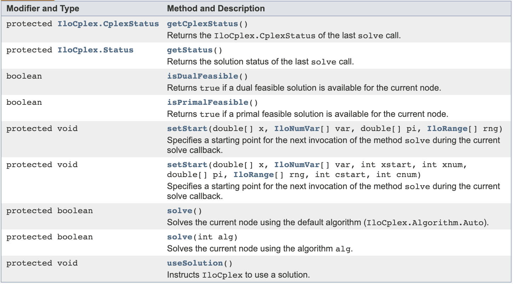

<a id="3323-用户割平面回调"></a>
#### 3.3.2.3 用户割平面回调
* IloCplex.UserCutCallback
* 在每个节点处添加特定于问题的用户定义割平面
* 当希望Cplex的所有割平面添加完毕之后再添加自定义的Cut，判断isAfterCutLoop()为Ture，再执行代码即可
* 特有函数
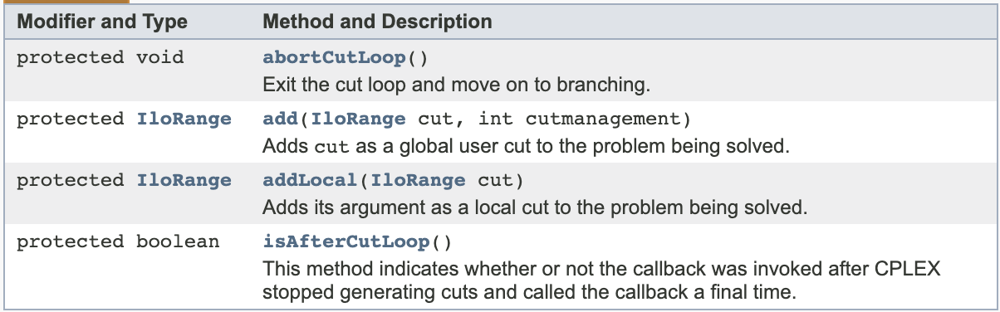

<a id="3324-惰性约束回调"></a>
#### 3.3.2.4 惰性约束回调
* IloCplex.LazyConstraintCallback
* 添加惰性约束（除非违反，否则不会进行评估的约束）
* 特有函数
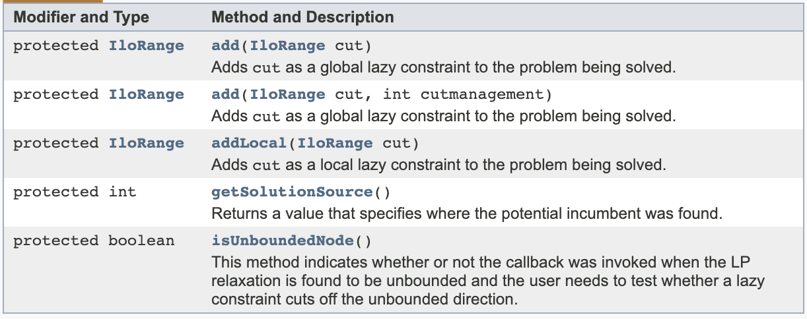

<a id="3325-探试回调"></a>
#### 3.3.2.5 探试回调
* IloCplex.HeuristicCallback
* 实现探试，该探试将尝试根据每个节点处的LP松弛解生成新的现任解

<a id="3326-分支回调"></a>
#### 3.3.2.6 分支回调
* IloCplex.BranchCallback
* 查询CPLEX在每个节点处进行分支的方式并选择性地加以覆盖

<a id="3327-现任解回调"></a>
#### 3.3.2.7 现任解回调
* IloCplex.IncumbentCallback
* 检查 CPLEX 在搜索期间找到的现任解并选择性地予以拒绝


<a id="34-回调的终止"></a>
## 3.4 回调的终止
将类IloCplex.Aborter 的实例传递给 IloCplex 的实例。 然后，调用IloCplex.Aborter.abort 方法以终止优化。

<a id="35-legacy-callback示例"></a>
## 3.5 Legacy Callback示例
<a id="351-admipex1-node-and-branch-callbacks"></a>
### 3.5.1 AdMIPex1: node and branch callbacks
<a id="3511-branch-callbacks"></a>
#### 3.5.1.1 branch callbacks
1. 继承 **IloCplex.BranchCallback** 生成自己的分支类，并设置属性及构造方法:
    * IloNumVar[] _vars

2. 实现main方法，可能用到的方法如下：
    * 判断分支策略
        - getBranchType()
        - IloCplex.BranchType.BranchOnVariable
    * 选择分支变量
        - getFeasibilities()
        - IloCplex.IntegerFeasibilityStatus.Infeasible
    * 构造分支
        - makeBranch()
        - IloCplex.BranchDirection.Up / Down

3. 调用自定义的BranchCallback子类

<a id="3512-node-callbacks"></a>
#### 3.5.1.2 node callbacks
1. 继承 **IloCplex.NodeCallback** 生成自己的分支类

2. 实现main方法，可能用到的方法如下：
    * getInfeasibilitySum()
    * selectNode()

3. 调用自定义的NodeCallback子类

<a id="352-admipex3-special-ordered-sets-type-1"></a>
### 3.5.2 AdMIPex3: Special Ordered Sets Type 1
1. 继承 **IloCplex.BranchCallback** 生成自己的分支类，并设置属性(IloSOS1)及构造方法
    * IloSOS1[] _sos

2. 实现main方法，可能用到的方法如下：
    * 选择分支变量
        - getFeasibilities()
        - IloCplex.IntegerFeasibilityStatus.Infeasible
        - getNumVars
    * 构造分支
        - makeBranch()
        - IloCplex.BranchDirection

3. 调用自定义的BranchCallback子类

<a id="353-admipex2-heuristiccallback"></a>
### 3.5.3 AdMIPex2: HeuristicCallback
1. 继承 **IloCplex.HeuristicCallback** 生成自己的启发式类，并设置属性及构造方法
    * IloNumVar[] _vars;

2. 实现main方法，可能用到的方法如下：
    * 变量处理
        - getFeasibilities()
        - IloCplex.IntegerFeasibilityStatus.Infeasible
    * 构造新的解
        - setSolution()

3. 调用自定义的HeuristicCallback子类，可能会用到的方法如下：
    - IloCplex.getNSOS1()
    - IloCplex.SOS1iterator()

<a id="354-admipex4-usercutcallback-and-lazyconstraintcallback"></a>
### 3.5.4 AdMIPex4: UserCutCallback and LazyConstraintCallback
1. 直接定义makeCuts方法，生成新的Cut约束，返回IloRange对象

2. 添加cuts
    cplex.addUserCuts()
    cplex.addLazyConstraints()

<a id="355-admipex5-usercutcallback-and-lazyconstraintcallback"></a>
### 3.5.5 AdMIPex5: UserCutCallback and LazyConstraintCallback
<a id="3551-usercutcallback"></a>
#### 3.5.5.1 UserCutCallback
To separate some constraints tend to be violated in LP relaxation dynamically

1. 继承 **IloCplex.UserCutCallback** 生成自己的UserCut类，并设置属性及构造方法
    * IloModeler modeler
    * IloNumVar[] vars

2. 实现main方法，可能用到的方法如下：
    * 添加Cut
        - add()
        - IloCplex.CutManagement.UseCutPurge(may be purged by cplex if it's ineffective)

3. 调用自定义的UserCutCallback子类

<a id="3552-usercutcallback"></a>
#### 3.5.5.2 UserCutCallback
Cuts that will be scanned every time.

1. 继承 **IloCplex.UserCutCallback** 生成自己的UserCut类

2. 实现main方法，可能用到的方法如下：
    * 添加Cut
        - (IloRange)cut.getLB()
        - (IloRange)cut.getUB()

3. 调用自定义的UserCutCallback子类

<a id="3553-lazyconstraintcallback"></a>
#### 3.5.5.3 LazyConstraintCallback
1. 继承 **IloCplex.LazyConstraintCallback** 生成自己的LazyCut类
    * IloModeler modeler
    * IloNumVar[] vars

2. 实现main方法，可能用到的方法如下：
    * 约束处理
        - IloLinearNumExpr sum = modeler.linearNumExpr()
        - sum.addTerm(1.0, supply[c][j])
        - IloCplex.IntegerFeasibilityStatus.Infeasible
    * 添加Cut
        - add(modeler.le(sum, 0.0))

3. 调用自定义的LazyConstraintCallback子类

<a id="356-admipex6-solvecallback：passing-in-a-solution-for-the-root-node"></a>
### 3.5.6 AdMIPex6: SolveCallback：passing in a solution for the root node
1. 继承 **IloCplex.SolveCallback** 生成自己的启发式类，并设置属性及构造方法
    * IloNumVar[] _vars;

2. 实现main方法，可能用到的方法如下：
    * 设置解
        - setStart()

3. 调用自定义的SolveCallback子类，可能会用到的方法如下：
    - IloConversion relax = IloCplex.conversion(lp.getNumVars(), IloNumVarType.Float)
    - cplex.add(relax)
    - cplex.delete(relax)


<a id="4-generic-callback"></a>
# 4 Generic Callback
<a id="41-简介"></a>
## 4.1 简介
通用回调是搜索解期间在许多不同位置调用的回调。基于 **`IloCplex.Callback.Function接口实现（需要覆盖invoke方法）`** 具有如下特点：

* 与动态搜索兼容。
* 无需禁用任何 MIP 功能。
* 监视进度以及引导搜索。
* 几乎专门处理原始模型；即，除某些情况以外，无权访问预求解模型和有关预求解模型的可用信息。
* 不会隐式更改 CPLEX 使用的线程数。
* 不会隐式序列化多线程求解中回调的执行。
* `提供比旧回调更高的灵活性，可在调用时根据回调的上下文（Context）来定义相应的操作`

<a id="42-功能"></a>
## 4.2 功能
* 查询有关当前求解状态和进度的信息
* 插入探试解
* 插入整数可行解作为候选值
* 获取当前松弛解
* 添加用户割平面
* 强制终止 

**`Attention:通用回调暂时不支持:`**  
1. 自定义的Branching， Node Selection，user solution of node problems  
2. 不能和Legacy Callback混用  
3. 不适用于Continuous problems  
4. 需要用户确保线程安全  

<a id="43-通用回调的上下文context"></a>
## 4.3 通用回调的上下文Context
CPLEX调用通用回调时所处的上下文确定可从该调用回调合理执行的操作。

<a id="431-ilocplexcallbackcontextid中的上下文常量"></a>
### 4.3.1 IloCplex.Callback.Context.Id中的上下文常量
<a id="4311-threadup"></a>
#### 4.3.1.1 ThreadUp
* This constant is used to specify CPLEX generic callback invocation when CPLEX activates a thread. 

<a id="4312-threaddown"></a>
#### 4.3.1.2 ThreadDown
* This constant is used to specify CPLEX generic callback invocation when CPLEX de-activates a thread.

<a id="4313-localprogress"></a>
#### 4.3.1.3 LocalProgress
* CPLEX invokes the generic callback in this context when it has made thread-local progress. 
* Thread-local progress is progress that happened on one of the threads used by CPLEX but has not yet been committed to global solution structures. 
* Information queried from a callback invoked in this context is valid only in the calling thread.
* The current information about the solution process can be queried with these routines: `getIntInfo()` and `getLongInfo()`, and `getIncumbent()`.

<a id="4314-globalprogress"></a>
#### 4.3.1.4 GlobalProgress
* CPLEX invokes the generic callback in this context when it has made global progress, that is, when new information has been committed to the global solution structures. 
* You can query the current globally valid information about the solution process with the routines `getIntInfo()` and `getLongInfo()`, and `getIncumbent()`.

<a id="4315-candidate"></a>
#### 4.3.1.5 Candidate
* CPLEX invokes the generic callback when it has found a new candidate for an integer-feasible solution or has encountered an unbounded relaxation. CPLEX offers the callback a chance to reject the candidate solution or the unbounded relaxation.
    - If `isCandidatePoint()` shows that CPLEX has found a candidate feasible point, then you can query that point by using `getCandidatePoint()`

    - If `isCandidateRay()` shows that CPLEX has encountered an unbounded relaxation, then you can get the unbounded ray from `getCandidateRay()`

    - In either the case, the user can reject the feasible point or unbounded direction by means of the routine `rejectCandidate()`
* Use the constant `Candidate` in two different ways:
    - As a value passed into the generic callback function to specify in which context the generic callback is invoked
    - As a bit-wise OR with the where argument of the routine CPXXcallbacksetfunc and CPXcallbacksetfunc to specify in which situations CPLEX should invoke the generic callback

<a id="4316-relaxation"></a>
#### 4.3.1.6 Relaxation
* CPLEX invokes the generic callback in this context when it has found a relaxed solution available. The relaxed solution is usually not integer feasible.
* You can query the relaxed solution with the routine `getRelaxationPoint()`.

<a id="432-使用方法"></a>
### 4.3.2 使用方法
1. 定义“上下文掩码”
    * long contextMask = IloCplex.Callback.Context.Id.Relaxation
    * 可以进行按位“或”操作：contextMask |= IloCplex.Callback.Context.Id.Candidate

2. IloCplex.use(IloCplex.Callback.Function, contextMask)

3. 常用方法总结
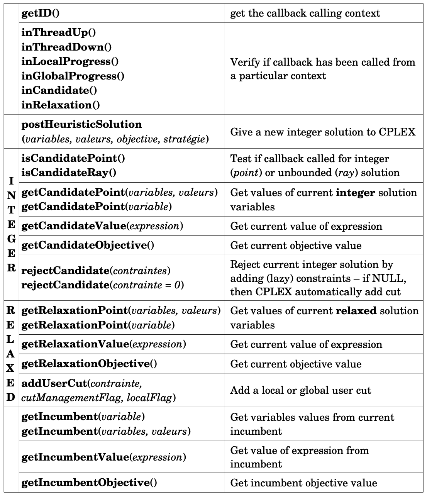

<a id="44-generic-callback示例"></a>
## 4.4 Generic Callback示例
<a id="441-admipex8-cut"></a>
### 4.4.1 AdMIPex8: Cut
1. 继承 **IloCplex.Callback.Function接口** 生成通用回调类，并设置属性及构造方法

2. contextMask = IloCplex.Callback.Context.Id.Relaxation | IloCplex.Callback.Context.Id.Candidate

3. 分别实现几种不同场景的对应函数
    * disaggregate()
        - 针对 Id = Relaxation 的情况
        - 目的：add disagrregated constraints linking clients and location
        - context.addUserCut()添加Cut，使用IloCplex.CutManagement.UseCutPurge
    * cutsFromTable()函数
        - 针对 Id = Relaxation 的情况
        - 目的：Uses a static table of cuts and scans this table for violated cuts
        - context.addUserCut()添加Cut，使用IloCplex.CutManagement.UseCutPurge
    * lazyCapacity()
        - 针对 Id = Candidate 的情况
        - 借助isCandidatePoint()判断
        - 添加约束
        - context.rejectCandidate()

4. 覆盖invoke方法，根据context值采取相应的操作

5. 使用IloCplex.use(Function callback, long contextMask)将通用回调添加到Cplex中

<a id="442-admipex9-heuristiccallback"></a>
### 4.4.2 AdMIPex9: HeuristicCallback
1. 继承 **IloCplex.Callback.Function接口** 生成通用回调类，并设置属性及构造方法

2. contextMask = IloCplex.Callback.Context.Id.Relaxation | IloCplex.Callback.Context.Id.Candidate

3. 启发式算法函数设计，这里用roundDown取整示意
    * context.postHeuristicSolution()添加启发式解到队列中

4. 覆盖invoke方法，根据context值采取相应的操作

5. 添加通用回调到Cplex中
    * 关闭Cplex的启发式算法，cplex.setParam(IloCplex.Param.MIP.Strategy.HeuristicFreq, -1);
    * 使用IloCplex.use(Function callback, long contextMask)将通用回调添加到Cplex中


<a id="5-cplex-官方示例说明"></a>
# 5 Cplex 官方示例说明
| Example | Description |
|:-|:-|
| AdMIPex1.java | 使用节点和分支回调来优化 MIP |
| AdMIPex2.java | 使用启发式回调来优化 MIP |
| AdMIPex3.java | 对具有特殊有序集合 (SOS) 的 MIP 使用分支回调 |
| AdMIPex4.java | 用于演示如何添加惰性约束和用户割平面 |
| AdMIPex5.java | 用于通过对 MIP 的割平面回调来添加割平面 |
| AdMIPex6.java | 用于从 LP 解启动 MIP 优化 |
| AdMIPex8.java | 使用用于在解法上下文中调用内点优化器和对偶优化器的通用回调 |
| AdMIPex9.java | 使用用于调用启发式的通用回调 |
| Benders.java | 用于演示 Benders 分解 |
| BendersATSP.java | 用于演示非对称旅行销售人员问题的自助 Benders 分解中对独立整数可行 LP 解法的惰性约束回调以及对独立小数不可行 LP 解法的用户割平面回调 |
| Blend.java | 用于对混合问题进行求解 |
| CplexServer.java | 用于说明如何在本机 J2EE 客户机应用程序中利用类 IloCplexModeler 来编写接受纯 Java 模型的优化服务器 |
| CutStock.java | 这是一个用于说明列生成的下料模型 |
| Diet.java | 这是经典饮食方案问题使用 Java 语言的实现；线性规划，可以按列（向饮食方案中添加食品）或按行（向饮食方案中添加需求）生成 |
| Etsp.java | 这是与提早和延迟成本相关的调度问题使用 Java 语言的实现 |
| Facility.java | 用于对仓库位置问题进行求解 | （可选）示例可应用 Benders 分解 |
| FixCost1.java | 用于对与固定成本相关的生产规划问题进行求解 |
| FoodManufact.java | 用于实施对 H. P. Williams 的建模教科书中著名食品生产规划问题的解 |
| GlobalQPex1.java | 用于说明如何读取凸面或非凸面二次规划模型 (QP) 或者混合整数二次规划模型 (MIQP) 以及如何对其进行求解以获得一阶或全局最优解 |
| Goalex1.java | 使用目标 API 进行分叉 |
| Goalex2.java | 使用目标 API 来添加割平面 |
| Goalex3.java | 使用目标 API 来添加节点评估程序；它派生自 Goalex1.java |
| IndefQPex1.java | 用于输入不确定二次规划（非 PSD QP）并对其进行求解以获得局部最优解 |
| InOut1.java | 这是一个生产模型 |
| InOut3.java | 这是另一个生产模型 |
| LPex1.java | 这是一个用于说明数据填充方法的基本线性规划模型 |
| LPex2.java | 这是一个基本线性规划模型，包含文件中的数据 |
| LPex3.java | 用于说明如何向模型中添加行以及如何重新优化 |
| LPex4.java | 用于说明回调 |
| LPex6.java | 用于说明如何装入基础 |
| LPex7.java | 用于说明如何访问列名称 |
| MIPex1.java | 这是一个基本 MIP 模型 |
| MIPex2.java | 这是另一个基本 MIP 模型 |
| MIPex3.java | 包括 MIP 模型中的特殊有序集合 (SOS) |
| MIPex4.java | 用于说明如何创建参考回调以及将其用于日志记录、限制节点数和中断优化；另外，还用于说明如何终止优化以及如何使用时间戳记 |
| MIQPex1.java | 这是一个混合整数二次规划模型；它包含 MIP 中的二次目标 |
| MixBlend.java | 这是一个 MIP 混合模型 |
| Populate.java | 用于说明如何在解池中生成和保存多个解 |
| QPex1.java | 包括 LP 中的二次目标 |
| QPex2.java | 这是另一个具有二次目标的模型 |
| QPex3.java | 对二次表达式使用 Concert Technology 接口，以便使用二次表达式来输入和修改目标函数中的模型 |
| Rates.java | 用于对与半连续变量相关的规划问题进行求解 |
| SocpEx1.java | 用于说明如何访问 SOCP 模型中的对偶值和缩减成本 |
| QCPDual.java | 用于说明如何访问二次约束规划模型 (QCP) 中的对偶值及缩减成本 |
| Steel.java | 用于对说明了模型构建方法的生产规划问题进行求解；它基于 Fourer、Gay 和 Kernighan 所编著的 AMPL 建模书籍中的 steelT.mod |
| Transport.java | 使用分段线性成本函数 |
| TuneSet.java | 用于分析一组模型以及提供建议的非缺省参数设置以提高性能 |
| Warehouse.java | 这是一个仓库位置问题；它使用目标 |
| InputDataReader.java | 由一些示例用于读取数据 |